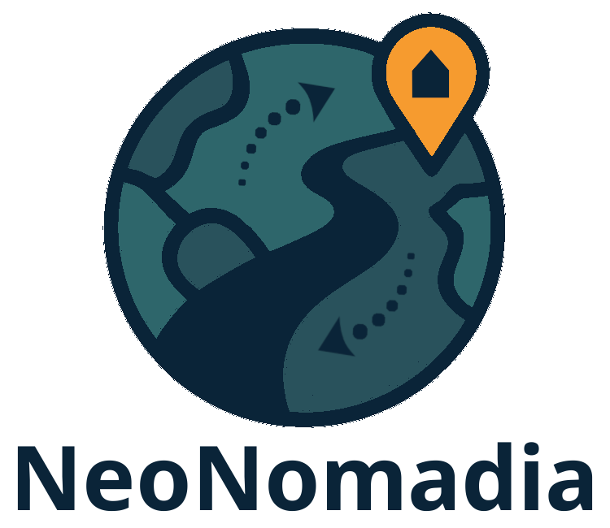

# Principles

## Social Principles

## Technical Principles

## Corporate Design

The NeoNomadia is represented by a logo which is mainly meant to be used on the neonomadia-project.org website:

This logo also defines the basic colors:

- dark blue: 10, 36, 56 (RGB)
- turquoise: 41, 82, 92 (RGB)
- light turquoise: 46, 102, 107 (RGB)
- light orange: 246, 155, 47 (RGB)

All additional colours have to much with this CD.

The basic font is **Noto Sans**.

