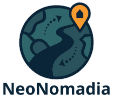

# Design Decisions

## Project Language

The primary language for communication and documentation — including code comments — is **English**.

In cases involving country-specific, ethnic, or linguistic topics, using the respective local language may be appropriate. However, whenever possible, an accompanying English translation should be provided to ensure clarity and inclusivity across the project.

## Project Management System

The selection of a project management system remains open. The tool must encourage **simplicity**, making it easy for all potential contributors to engage comfortably.

Another key factor is **role management** — the system should support well-defined contributor roles that reflect NeoNomadia’s collaborative ethos.

This decision will be revisited once the initial roadmap is finalized and the project's evolving vision offers greater clarity on long-term requirements.

## Corporate Design

NeoNomadia is visually anchored by a distinctive logo, primarily designed for use on the project website:

This logo establishes the project's core color palette:

| Color Name | RGB | HEX Code |
|------------|-----|----------|
| **Dark Blue** | 10, 36, 56 | #0A2438 |
| **Turquoise** | 41, 82, 92 | #29525C |
| **Light Turquoise** | 46, 102, 107 | #2E666B |
| **Light Orange** | 246, 155, 47 | #F69B2F |

All additional design elements must align with this visual identity to maintain a coherent and recognizable presence across media.

The preferred typeface is **Noto Sans**, chosen for its modern clarity and wide multilingual support.

It is available as:

- **Browser font** via [Google Fonts](https://fonts.google.com/noto/specimen/Noto+Sans.) for web integration:
  - CSS 
    ~~~
    font-family: 'Noto Sans', sans-serif;
    ~~~
  - HTML
    ~~~
    <link href="https://fonts.googleapis.com/css2?family=Noto+Sans&display=swap" rel="stylesheet">
    ~~~
- **Downloadable TTF files** for desktop or local hosting via [1001 Fonts](https://www.1001fonts.com/noto-sans-font.html)
    or [CDNFonts](https://www.cdnfonts.com/noto-sans.font)

